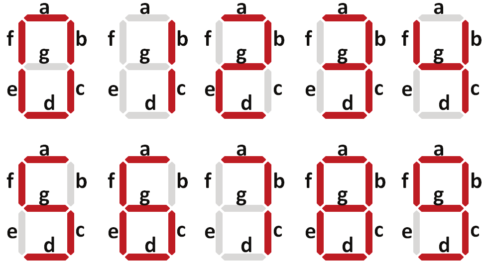
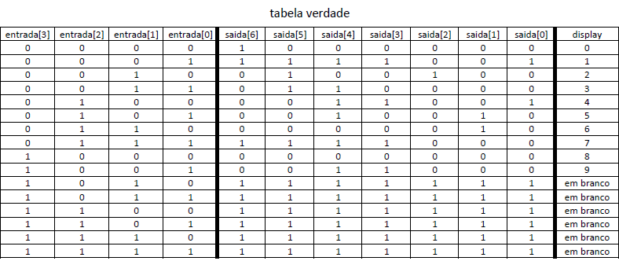
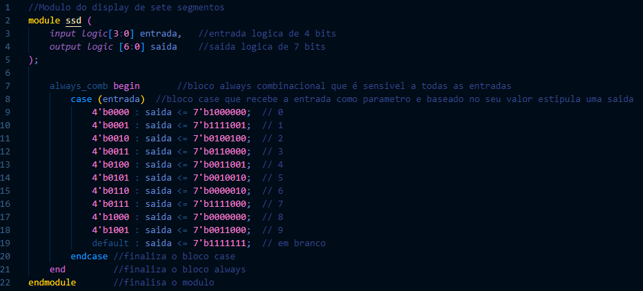
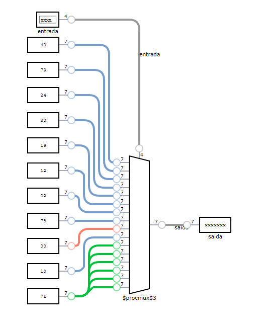

Display de 7 Segmentos – Relatório
Nome: Orleoncio Maciel de Oliveira Filho
Matricula: 20181045050165

1.	Objetivo
O objetivo do projeto era criar um código em system verilog que gerasse um circuito que fosse capaz de receber uma entrada de 4 bits e baseado na entrada devolver uma saída que fosse capaz de alimentar um display de 7 segmentos e mostrar o número entre 0 e 9 correspondentes com a entrada de 4 bits escolhida.
 
2.	Metodologia
A metodologia utilizada para a elaboração do projeto foi:
    a.	Analise do display de 7 seguimentos
    Ao analisar o display de 7 seguimentos foi constatado que ele já possui para cada seguimento uma nomenclatura padrão, sendo esta adotada por letras que vão do “a” ao “g”, então após definir quais seguimentos deveriam ficar ligados para que o display mostrasse os números de 0 a 9 foi possível passar ao próximo passar que seria criar a tabela verdade para que esse sistema funcionasse.

    

    b.	Elaboração da tabela verdade
    A elaboração da tabela verdade partiu do pressuposto que a entrada seria de um numero de 4 bits e a saída deveria ser de um numero de 7 bits onde cada bit seria referente a um segmento do display, a associação feita na tabela verdade foi que a letra “g” seria associada ao bit mais significativo no caso a saída[6] do nosso código e a letra “a” seria associada ao bit menos significativo no caso a saída[0], e além disso as saídas com valor logico alto foram associadas aos seguimentos desativados.

    

    c.	Elaboração do código
    A Elaboração do código foi iniciada já tendo grande parte do que seria feito em mente após muita pesquisa, estudando a documentação do system verilog descobri o bloco case e descobri que ele já é normalmente usado neste tipo de projeto, utilizando o bloco case eu posso passar um parâmetro para ele que no caso se trata da nossa entrada e baseado em cada possível entrada podemos escolher um valor especifico para nossa saída.

    

3.	Resultados
O resultado do código elaborado foi o circuito abaixo, testando cada uma das possíveis entradas conseguimos, comparando com a tabela verdade, concluir que o circuito está se comportando da maneira esperada, quando adicionado o número 1 em binário (0001) a saída do circuito mostra (1111001) ou seja apenas dois segmentos estão ligados formando assim o número referente a entrada.

4.	Conclusão
Logo podemos dizer que o projeto da elaboração de um circuito para alimentar um display de 7 segmentos foi um pouco complexo pois envolvia métodos do system verilog que eu ainda não conhecia, mas no fim com muita pesquisa foi possível se chegar a uma conclusão aceitável do projeto.
